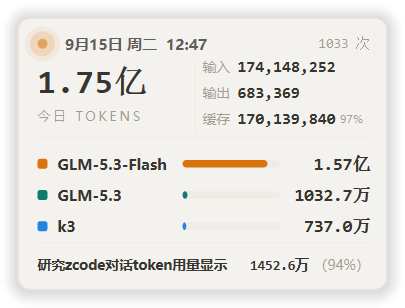

# ZCode Tokens Card

**English**: A paper-style floating card for Windows that shows your daily [ZCode](https://z.ai) desktop token usage and your OpenCode Go plan quota in real time — two tabs: usage (total, input/output/cache breakdown, top models, current conversation, plus live generation speed both overall and per top-3 model) and plan (5-hour / weekly / monthly used percentage with reset countdown). Read-only, zero writes to ZCode data.

一个纸感风格的 Windows 桌面悬浮卡，实时展示你在 ZCode 桌面端的当日 token 用量与 OpenCode Go 套餐额度：顶行两格 tab 切换「用量」（总量大数字、输入/输出/缓存三列、模型占比、当前对话消耗，以及实时生成速度——顶行当前速率 + 前三模型各自速率）与「套餐」（5 小时 / 本周 / 本月已用百分比 + 重置倒计时）。对 ZCode 数据**只读、零写入**。



## 功能特性 / Features

- **今日用量**：总量中文单位大数字（万/亿），输入、输出、缓存三列千分位完整数字，缓存行附占比小字；今日调用轮次显示在「今日 TOKENS」右侧。
- **模型占比条**：当日 TOP3 模型平滑占比条（宽度按总量归一），每行右端附该模型的实时速率与当日累计。
- **实时生成速度**：顶行显示当前速率（`tok/s`，取最近一次已完成调用的真实生成窗口，已排除首字等待），前三模型行各显示自己的速率。超过 60 秒没有新生成则显示「空闲」，不留陈旧数字。速率只统计 `output_tokens`，与含缓存的「今日总量」是两个口径。
- **增量摊放动画**：每段到账用量按其真实产生节奏（1~3 秒一跳）分步释放为显示值，数字常跳、显示落后有界且总量守恒；每次释放伴随「+N」飘字。
- **当前对话行**：底部显示你正在查看的会话标题及其全部消耗（含缓存占比），跟随会话切换。
- **套餐额度页**：顶行「套餐」tab 显示 OpenCode Go 三个窗口（5 小时 / 本周 / 本月）的已用百分比、进度条与重置倒计时；大数字取最接近上限的窗口，已用 ≥90% 转警示色。60 秒轮询一次，失败时保留上次数值并标注"数据陈旧"，未配置 Key 时灰字提示。
- **跟随显示**：可开启"仅 ZCode 聚焦时显示"，切走自动隐藏。
- **系统托盘**：常驻托盘菜单（跟随显示 / 开机自启动 / 显示隐藏 / 退出）；开机自启动写当前用户注册表 Run 键，无需管理员，exe 挪位后下次启动自动修正路径。
- **单实例**：重复启动只会唤醒已有窗口。
- **位置记忆**：拖动后记住位置，换屏/丢失屏幕时自动落回主屏右下角。
- **容错**：读不到数据（无 ZCode / 库被锁）时呼吸灯变红橙提示"数据源异常"，程序不崩溃，下次轮询自动重连。

## 工作原理 / How it works

| 数据源 | 用途 | 权限 |
|---|---|---|
| `~/.zcode/cli/db/db.sqlite`（`model_usage` / `session` 表） | 当日统计、模型占比、会话消耗、生成速率（用 `first_token_at` / `completed_at`） | 只读（SQLite `mode=ro`） |
| `%APPDATA%/ZCode/session/Local Storage/leveldb` | 「当前对话」的会话切换信号 | 只读（字节启发式扫描） |
| `~/.zcode/v2/provider_config.json` | 取 OpenCode Go 供应商的 API Key（套餐页取数用） | 只读 |
| `https://opencode.ai/zen/go/v1/usage` | 套餐额度（5 小时 / 本周 / 本月） | 只读 GET，60 秒一次，仅带该 API Key |

本项目对 ZCode 数据目录**零写入**；对外的唯一网络访问是上表最后一行（可用环境变量 `OPENCODE_GO_API_KEY` 覆盖 Key、`OPENCODE_GO_USAGE_URL` 覆盖地址；也可用 `OPENCODE_GO_PROXY` 指定代理）。统计口径（按本地零点切日、缓存不计入总量重复计算等）集中在 `stats.py` 与 `reader.py`，UI 不自行计算。生成速率同样是纯口径计算：`output_tokens ÷ (completed_at − first_token_at)`，分母排除首字等待（实测首字等待常占整轮一半，用整轮时长会把速度低估一半以上）。

## 环境要求 / Requirements

- Windows 10 / 11
- 本机装有 ZCode 桌面端（数据源缺失时卡片进入异常态，不会崩溃）
- Python 3.12+，PySide6

## 快速开始 / Quick start

```bash
git clone https://github.com/wgl2zj/zcode-tokens-card.git
cd zcode-tokens-card
python -m pip install PySide6
python main.py
```

启动后桌面右下角出现悬浮卡，系统托盘出现 Z 图标；左键拖动卡片，右键托盘图标配置。

## 打包为单文件 exe / Build

```bash
python -m pip install pyinstaller
python tools/make_icon.py          # 生成/更新图标(托盘图标变化时)
python -m PyInstaller ZCodeTokensCard.spec --noconfirm --distpath dist --workpath build
```

产物为免安装单文件 `dist/ZCodeTokensCard.exe`。更多细节（自启动、状态文件位置等）见 [docs/打包分发说明.md](docs/打包分发说明.md)。

## 项目结构 / Layout

```
main.py      # 入口：单实例、托盘、轮询装配（用量 1.5s / 额度 60s 后台线程）
card.py      # 悬浮卡渲染与交互（QPainter 自绘，用量页 + 套餐页）
quota.py     # OpenCode Go 套餐额度取数（Key 发现、出口降级、解析、倒计时）
reader.py    # 数据源只读入口（SQLite mode=ro）
current.py   # 当前对话解析（leveldb 扫描 + 数据库主信号裁决）
drip.py      # 增量摊放调度（数字动画节拍源）
stats.py     # 聚合、中文单位换算与生成速率口径
theme.py     # 配色常量
autostart.py # 开机自启动注册表读写
config.py    # 状态持久化（窗口位置）
tests/       # pytest 测试（python -m pytest -q）
docs/        # 打包分发说明、设计稿
tools/       # 图标生成、截图验收脚本
```

## 已知限制 / Known limitations

- 依赖 ZCode 的内部数据结构（表结构、localStorage 键名）；ZCode 大版本更新可能使部分显示退化（如"当前对话"失去切换跟随），但不会产生错误数据。
- PyInstaller 打包的 exe 偶被杀毒软件误报，加入白名单即可。

## License

[MIT](LICENSE)
